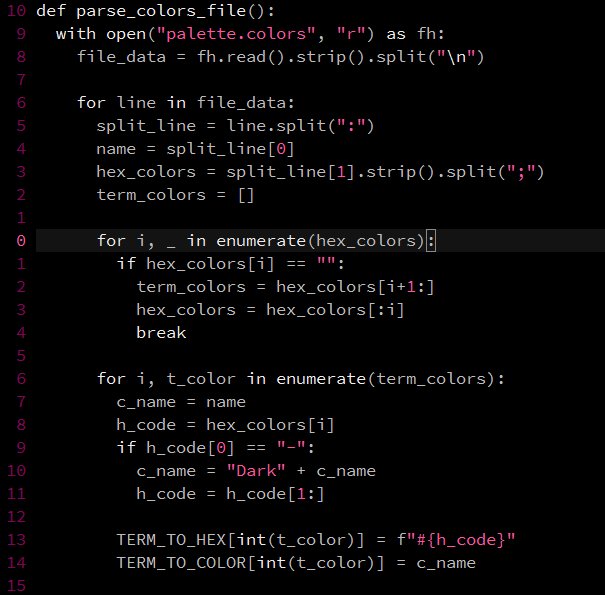
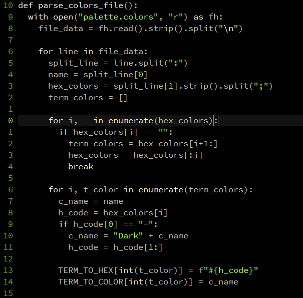
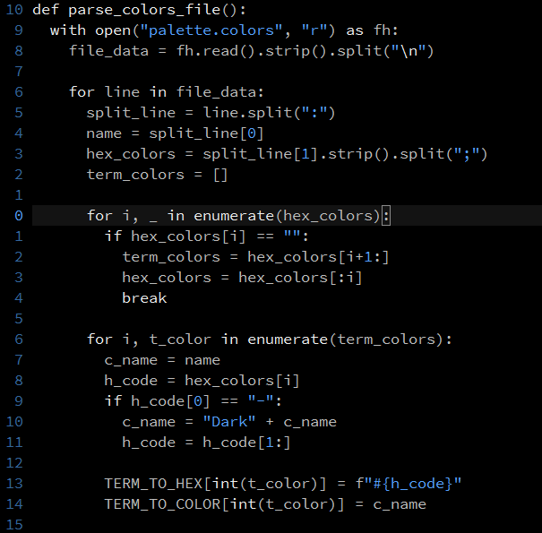

Film Noir
---------

A minimal vim colorscheme, focusing on clarity and simplicity.

Based off of the colorscheme ["vim-256noir"](https://github.com/andreasvc/vim-256noir/) by [Andreas van Cranenburgh](https://github.com/andreasvc).

# Installation

```Viml
Plug 'kyoto-shift/film-noir'
" ...
let g:film_noir_color='red' " also: 'green', 'blue' (default)
colorscheme film_noir

" Change highlighting of cursor line when entering/leaving Insert Mode
set cursorline
highlight CursorLine cterm=NONE ctermfg=NONE ctermbg=233 guifg=NONE guibg=#121212
autocmd InsertEnter * highlight CursorLine cterm=NONE ctermfg=NONE ctermbg=234 guifg=NONE guibg=#1c1c1c
autocmd InsertLeave * highlight CursorLine cterm=NONE ctermfg=NONE ctermbg=233 guifg=NONE guibg=#121212
```

# Screenshots

Font in screenshots is Source Code Pro at h13

```Viml
let g:film_noir_color='red'
```


```Viml
let g:film_noir_color='green'
```


```Viml
let g:film_noir_color='blue'
```



# License

[GNU General Public License v2.0](LICENSE)